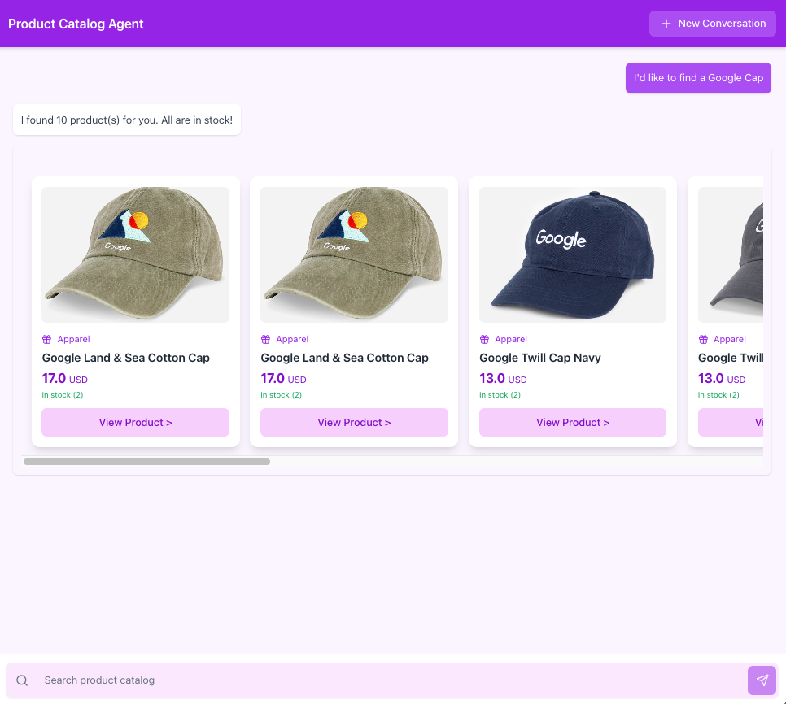

# Catalog Agent with ADK for Generative AI & Marketing for Cymbal E-Commerce Hackathon

Generative AI & Marketing for Cymbal E-Commerce challenget lab offers hands-on experience with various Generative AI functions. While it can be completed individually, it's designed for teams of up to three participants. 

## Catalog Agent (Python with ADK)

This sample code uses the Agent Development Kit (ADK) to create an agent that searches a product catalog using the Search for Commerce API. 

## Agent Client Application (Javascript with React.js)

This react app is generated by Gemini 2.5 Pro. A simple agent UI and disploy catalog search UI. 

