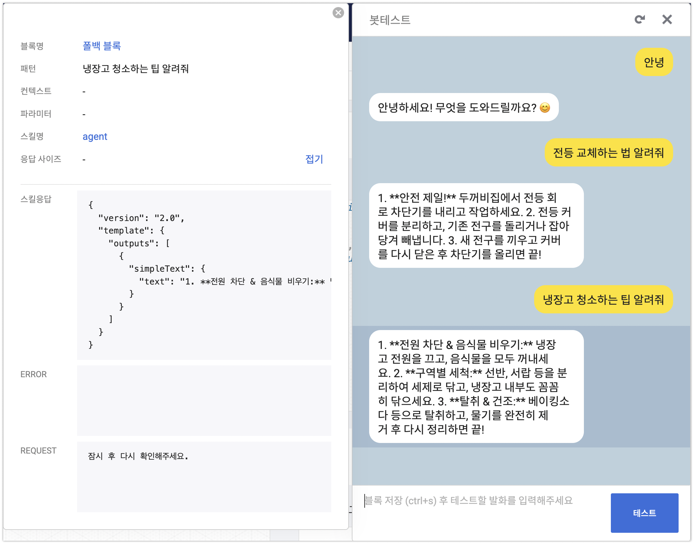

# Kakao Skill Server calling ADK Agent

## Set up and install 

1. Set up a virtual environment
    ```bash
    cd agents
    python -m venv .venv
    source .venv/bin/activate
    ```
1. Run the following command to install the required packages.(ex. google-adk)
    ```bash
    pip install -r requirements.txt
    ```
1. Set up a [Google Cloud project](https://cloud.google.com/vertex-ai/generative-ai/docs/start/quickstarts/quickstart-multimodal#setup-gcp)
1. Enable the [Vertex AI API](https://console.cloud.google.com/flows/enableapi?apiid=aiplatform.googleapis.com).

## Run and test (Agent)

1. Update .env file
    ```bash
    GOOGLE_GENAI_USE_VERTEXAI=TRUE
    GOOGLE_CLOUD_PROJECT=<YOUR_PROJECT_ID>
    GOOGLE_CLOUD_LOCATION=us-central1
    MODEL=gemini-2.0-flash-001
    ```
1. start with Dev UI(adk web)
    Run the following command to launch the developer Web UI.
    ```bash
    adk web
    ```

## Run and test (API) 

```bash
python main.py
```

## deployment 

### Environment variables for the agent

```bash
export GOOGLE_CLOUD_LOCATION=us-central1
export GOOGLE_GENAI_USE_VERTEXAI=TRUE
export GOOGLE_CLOUD_PROJECT=<YOUR PROJECT ID>
```

### Deploy agent to Cloud Run

```bash
cd agents
gcloud run deploy skill-sever-agent \
--source . \
--region $GOOGLE_CLOUD_LOCATION \
--project $GOOGLE_CLOUD_PROJECT \
--allow-unauthenticated \
--set-env-vars="GOOGLE_CLOUD_PROJECT=$GOOGLE_CLOUD_PROJECT,GOOGLE_CLOUD_LOCATION=$GOOGLE_CLOUD_LOCATION,GOOGLE_GENAI_USE_VERTEXAI=$GOOGLE_GENAI_USE_VERTEXAI"
```

### Test the API with curl

Use the Service URL. 

#### local Test 
```
curl -X POST http://0.0.0.0:8080/call_agent \
    -H "Content-Type: application/json" \
    -d '{ "userRequest": { "utterance": "안녕" }}'
```

#### Cloud Run Test 
```
curl -X POST {CLOUD_RUN_SVC_URL}/call_agent \
    -H "Content-Type: application/json" \
    -d '{ "userRequest": { "utterance": "안녕" }}'
```

